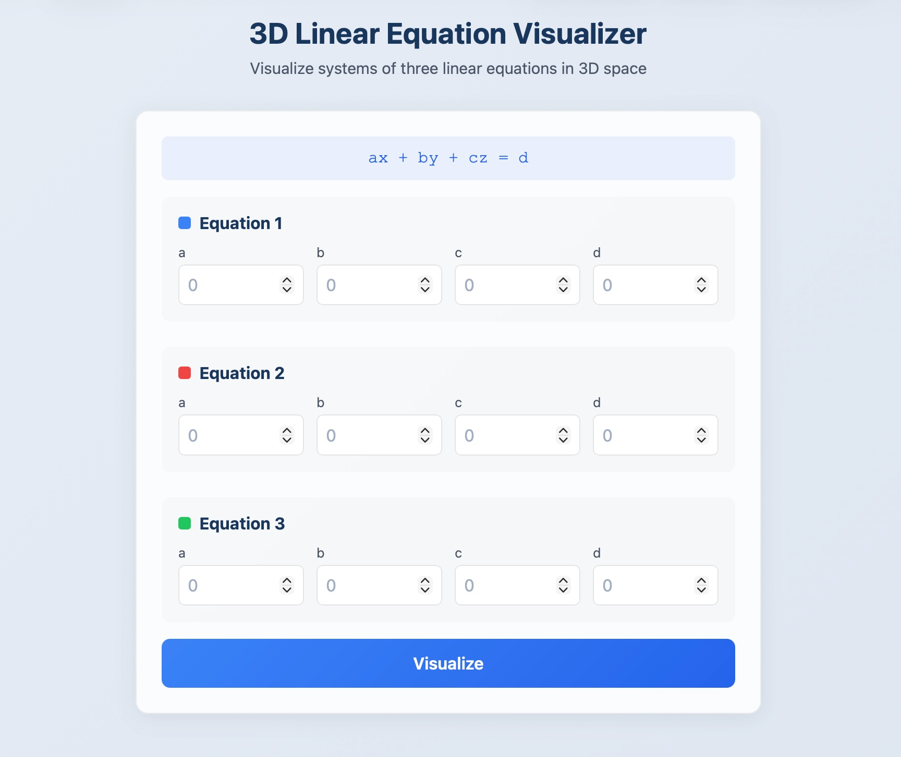
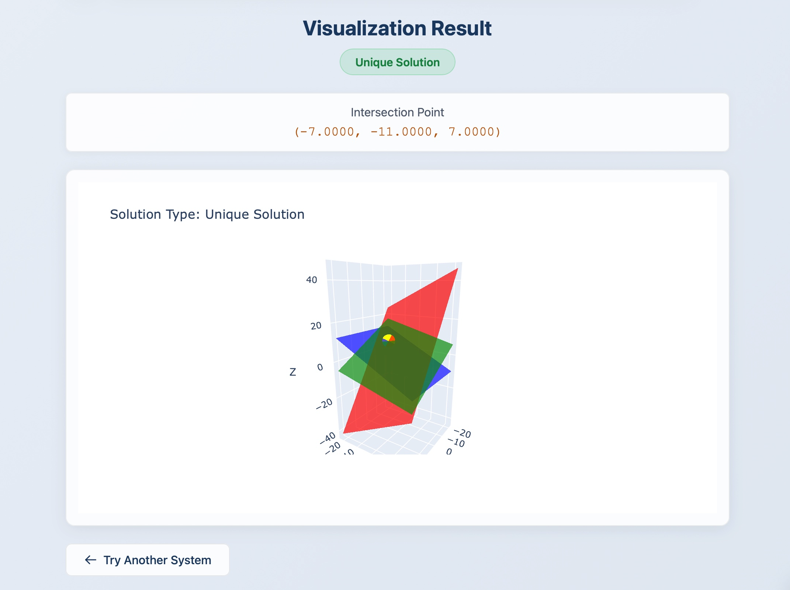
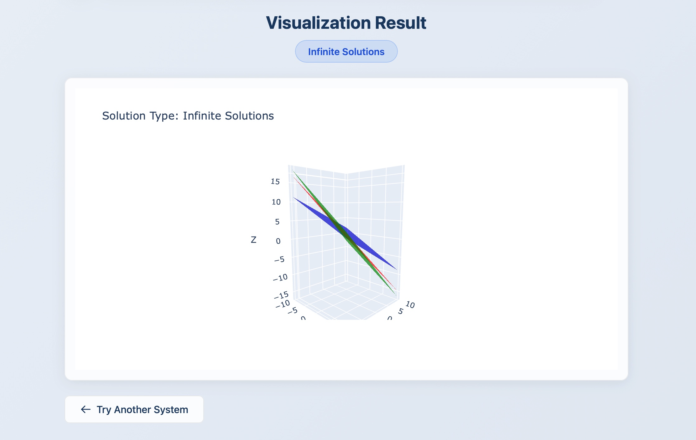
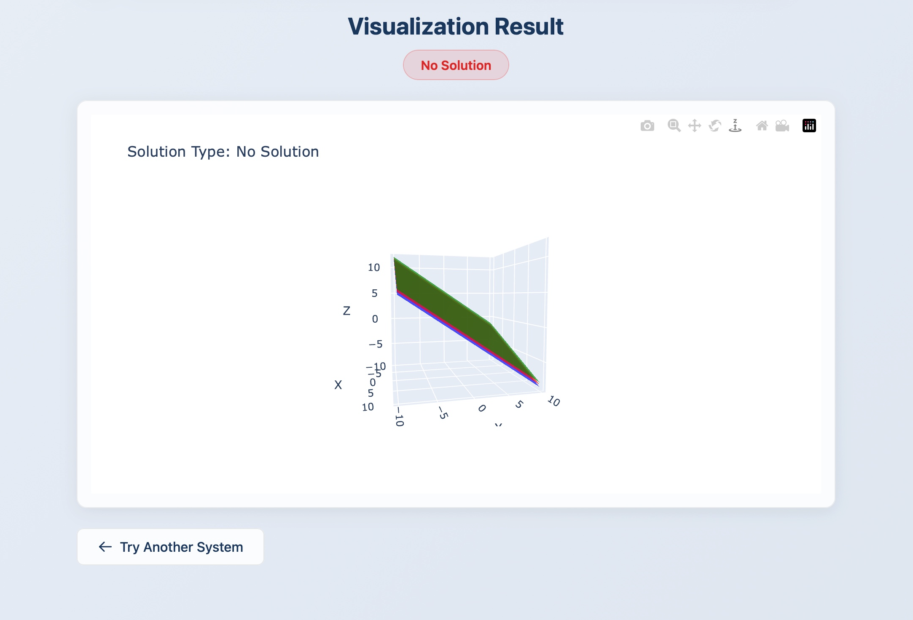

# 3D Linear Equation Visualizer

A web application that visualizes systems of three linear equations as 3D planes using Flask, NumPy, and Plotly.

## Understanding 3D Linear Systems

To visualize a system of linear equations in 3D (i.e., equations with 3 different variables), you must use **planes**. Planes are the 3D equivalent of lines in 2D space.

### 2D vs 3D Linear Systems

When solving 2D linear equations (2 variables), the solutions can be:
- **A single point** - where two non-parallel, non-identical lines intersect
- **A line** - when both equations represent the same line (infinite solutions)
- **Empty (no solution)** - when the two lines are parallel and never meet

This same principle applies to 3D linear equation systems, but the intersections are more complex to visualize:

### Types of 3D Intersections

| Solution Type | What It Looks Like | Example Scenario |
|---------------|-------------------|------------------|
| **Unique Solution (Point)** | All three planes intersect at exactly one point | Three planes meeting at a single corner |
| **Infinite Solutions (Line)** | Three planes intersect along a common line | Three pages of a book meeting at the spine |
| **Infinite Solutions (Plane)** | All three equations represent the same plane | Three identical planes stacked together |
| **No Solution** | Planes are parallel or form a triangular prism with no common intersection | Three walls of a triangular room with no common corner |

## Screenshots

<!-- Add your screenshots here -->

*Input form for entering equation coefficients*


*Three planes intersecting at a single point*


*Three planes intersecting along a line*


*Three parallel planes with no intersection*

## Installation

1. Clone the repository:
   ```bash
   git clone https://github.com/yourusername/3d-linear-visualizer.git
   cd 3d-linear-visualizer
   ```

2. Install dependencies:
   ```bash
   pip install -r requirements.txt
   ```

3. Run the application:
   ```bash
   python app.py
   ```

4. Open your browser and navigate to `http://localhost:5000`

## Usage

1. Enter the coefficients for three linear equations in the form `ax + by + cz = d`
2. Click "Visualize" to see the 3D representation
3. Interact with the 3D plot by rotating, zooming, and panning
4. The solution type will be displayed along with the intersection point (if unique)

### Example Inputs

**Unique Solution (Single Point):**
```
Equation 1: 1x + 0y + 0z = 2
Equation 2: 0x + 1y + 0z = 3
Equation 3: 0x + 0y + 1z = 4
Solution: (2, 3, 4)
```

**Infinite Solutions (Line):**
```
Equation 1: 1x + 1y + 0z = 5
Equation 2: 2x + 2y + 0z = 10
Equation 3: 1x + 0y + 1z = 3
```

**No Solution (Parallel Planes):**
```
Equation 1: 1x + 1y + 1z = 1
Equation 2: 1x + 1y + 1z = 2
Equation 3: 1x + 1y + 1z = 3
```

## How It Works

The application uses the **Rouche-Capelli theorem** to determine the solution type:
- If `rank(A) < rank([A|b])`: No solution (inconsistent system)
- If `rank(A) = rank([A|b]) = 3`: Unique solution
- If `rank(A) = rank([A|b]) < 3`: Infinite solutions

Where `A` is the coefficient matrix and `[A|b]` is the augmented matrix.

## Technologies

- **Flask** - Web framework
- **NumPy** - Linear algebra computations
- **Plotly** - Interactive 3D visualizations

## License

MIT License